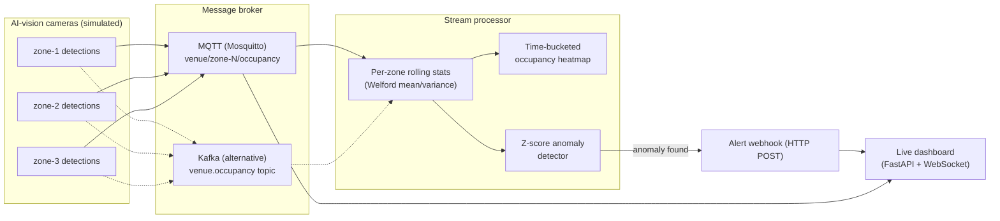

# IoT Video Event Stream Analytics

Cameras with AI vision models are everywhere now — they can tell you "12 people in this frame" or "someone just walked into zone 3" many times a second. That raw stream of numbers is not, by itself, useful to a person running a building or an event. This project takes that stream of per-camera-zone detections (occupancy counts, entries, exits), turns it into rolling statistics per zone, automatically flags when a zone's occupancy looks abnormal compared to its own recent history, pushes an alert the moment that happens, and shows everything on a live dashboard. It's a small, self-contained example of the kind of "detections in, decisions out" pipeline that sits behind crowd and occupancy monitoring in places like stadiums, transit stations, city plazas, school campuses, or hospital waiting areas.

## Why this matters

A single camera detection ("14 people right now") is not a signal anyone can act on. What operations teams actually want to know is things like: *"zone 2 is unusually busy right now, more than its normal pattern would suggest"* or *"there was a sudden and sharp change in this area."* That requires turning a firehose of raw per-frame numbers into a small number of trustworthy, business-level signals, and then getting those signals to a person or a system fast enough for them to do something about it.

This is a genuinely common day-to-day engineering problem, not a one-off script: you have a continuous stream of sensor/vision events, you need a running notion of "normal" for each independent source, you need to flag departures from that normal without generating alert fatigue, and you need to push the result somewhere useful instead of making every downstream system poll for it. The same shape shows up well beyond occupancy counting — anomaly detection on IoT sensor telemetry, unusual traffic in a network stream, spikes in application metrics — which is why the core of this repo (a streaming statistics engine plus a Z-score detector) is written to be reusable, not occupancy-specific.

## Architecture



The dashboard subscribes to the same raw occupancy stream (for the live numbers and heatmap) and also runs a small HTTP endpoint that receives pushed alerts from the processor — that endpoint is the "Alert webhook" in the diagram.

## Design decisions

### Why MQTT here, and when to switch to Kafka

MQTT is a lightweight publish/subscribe protocol built for exactly this shape of problem: lots of small, independent producers (one per camera/zone) each publishing frequent, small messages, and one or more consumers that want "give me everything new on this topic." It's the standard choice across IoT and camera ecosystems, it's trivial to run (a single `eclipse-mosquitto` container), and the topic-per-zone pattern (`venue/zone-1/occupancy`, `venue/zone-2/occupancy`, ...) maps naturally onto "one independent stream per physical zone."

You'd reach for Kafka instead once you hit any of these:

- **Volume.** MQTT brokers are built to fan out messages to a modest number of subscribers, not to sustain sustained high-throughput ingestion across thousands of independent producers. Kafka is built for that.
- **Replay.** MQTT is fire-and-forget — once a message is delivered, it's gone (unless a client happens to be a persistent subscriber that was connected at the time). Kafka retains messages on disk for a configurable retention window, so you can reprocess the last hour/day/week of events — useful for backfilling a new anomaly model or recovering from a bug in a consumer.
- **Multiple independent consumer groups.** If you need one service doing anomaly detection, another archiving raw events, and another feeding a feature store, all reading the *same* stream independently and at their own pace, Kafka's consumer-group model is built for exactly that. With MQTT, fan-out to multiple *independent, replayable* readers is awkward.

This repo ships both: `src/processor/stream_processor.py` (MQTT, the fully-tested default) and `src/processor/kafka_consumer.py` (Kafka, a documented alternative that reuses the identical `StreamProcessor.process_event` logic — only the transport changes).

### Welford's algorithm, in plain English

If you want the running average of a stream of numbers, the naive approach is: keep every number you've seen, and every time a new one arrives, sum everything and divide by the count. That's obviously wasteful — you'd be storing unbounded history just to compute one number.

A slightly-less-naive approach is to keep a running sum and a running sum-of-squares, and derive the mean and variance from those two totals. That *is* O(1) memory, but it has a real numerical problem: variance from sum-of-squares involves subtracting two large, similar numbers (`sum(x²)` and `(sum(x))²/n`), and for long streams with values that aren't close to zero, that subtraction loses precision — sometimes badly enough to make the computed variance negative, which is nonsensical.

Welford's algorithm (1962) solves both problems at once. Instead of tracking raw sums, it tracks a running mean and a running sum of squared *deviations from the current mean*, and updates both every time a new value arrives using a small, numerically well-behaved formula. The result:

- **O(1) memory per zone**, regardless of whether you've seen 10 events or 10 million. You never store the history, only three or four running numbers.
- **O(1) time per update** — one new event is one small arithmetic update, not a recomputation over history.
- **Numerically stable** — no large-number cancellation, so long-running streams don't quietly drift into wrong answers.

That's exactly what you want for a service that's supposed to keep a rolling "normal" for a zone that might run for weeks without a restart.

### Z-score anomaly detection, with a worked example

Once you have a rolling mean and standard deviation for a zone, the Z-score of a new value just answers "how many standard deviations away from normal is this?":

```
z = (value - mean) / std
```

**Worked example.** Suppose zone-2's rolling stats, built from the last several minutes of normal traffic, are `mean = 45.0` people and `std = 5.0` people. A new reading comes in: `occupancy = 70`.

```
z = (70 - 45) / 5 = 25 / 5 = 5.0
```

A Z-score of 5 means this reading is five standard deviations above what's typical for this zone — under a roughly normal distribution, that's an extremely rare event by chance alone (on the order of 1 in a few hundred thousand). With a configured threshold of, say, 3.0, `|5.0| > 3.0` so this event is flagged as an anomaly and an alert fires. Compare that to a reading of `52`: `z = (52 - 45) / 5 = 1.4`, comfortably under the threshold, so no alert — that's just normal fluctuation.

Two practical details matter as much as the formula itself:

- **Cold start.** With only one or two data points, the "rolling std" isn't a trustworthy estimate of normal yet — it might even be zero, which would make every subsequent value look infinitely anomalous. The detector (`src/processor/anomaly.py`) refuses to flag anything until a configurable minimum sample count has been observed for that zone.
- **A near-constant stream.** If a zone's occupancy genuinely hasn't varied at all, `std` can be extremely close to zero, and dividing by it would blow the Z-score up numerically. A small floor is applied to `std` before dividing so the score stays finite and meaningful instead of producing `inf`/`NaN`.

### Why push alerts to a webhook instead of polling

If a downstream system (a dashboard, an on-call notifier, a ticketing system) has to *ask* "anything new?" on a timer, you're always trading off latency against wasted requests — poll fast and you burn resources on empty checks, poll slow and you delay real alerts. Pushing an HTTP POST to a configured webhook the instant an anomaly is detected means the delay is essentially the network round trip, not however long the poller's next cycle takes, and idle periods cost nothing. It also decouples the processor from knowing anything about who consumes its alerts — it POSTs a JSON payload to a URL; whether that URL belongs to a dashboard, a chat-ops bot, or an incident system is not the processor's concern.

## Setup & run (Docker Compose)

Requirements: Docker and Docker Compose.

```bash
docker compose up -d --build
```

This starts four containers:

| Service     | What it does                                                                 |
|-------------|-------------------------------------------------------------------------------|
| `mosquitto` | The MQTT broker all the other services talk through.                        |
| `producer`  | Publishes synthetic per-zone occupancy events, with a spike injected into `zone-2` at 30 seconds in, for demo purposes. |
| `processor` | Consumes events, keeps rolling stats + anomaly detection per zone, POSTs alerts to the dashboard's webhook. |
| `dashboard` | FastAPI + WebSocket UI showing live occupancy, rolling stats, and alerts.    |

Once it's up, open **http://localhost:8088/** in a browser to watch the numbers update live, and watch `docker compose logs -f processor` to see anomaly detections as they happen (the injected spike in `zone-2` around the 30-second mark should trigger several).

Useful endpoints on the dashboard:

- `GET /` — the live HTML dashboard.
- `GET /api/snapshot` — the same data as JSON (rolling stats, heatmap, alerts).
- `WS /ws` — the WebSocket the dashboard page itself uses.
- `POST /alerts` — the webhook receiver the processor pushes anomaly alerts to.

To stop everything:

```bash
docker compose down
```

### Running components individually (without Docker)

```bash
pip install -r requirements.txt

# In separate terminals, with a Mosquitto broker running on localhost:1883:
python -m src.producer.simulate_events --rate 2 --spike-zone zone-2 --spike-at 20
python -m src.processor.stream_processor --webhook-url http://localhost:8000/alerts
uvicorn src.dashboard.api:app --reload
```

## Project structure

```
.
├── Dockerfile
├── docker-compose.yml
├── mosquitto/
│   └── mosquitto.conf          # minimal broker config (anonymous access, for local/demo use)
├── requirements.txt
├── pyproject.toml              # ruff + pytest config
├── src/
│   ├── producer/
│   │   └── simulate_events.py  # synthetic AI-vision event generator (MQTT publisher)
│   ├── processor/
│   │   ├── welford.py          # streaming mean/variance (Welford's algorithm)
│   │   ├── anomaly.py          # Z-score anomaly detection on top of Welford stats
│   │   ├── stream_processor.py # MQTT consumer: rolling stats + heatmap + alert dispatch
│   │   └── kafka_consumer.py   # Kafka consumer variant (same processing logic)
│   └── dashboard/
│       └── api.py              # FastAPI + WebSocket live dashboard, alert webhook receiver
├── tests/
│   ├── test_welford.py                      # vs. numpy batch mean/variance
│   ├── test_anomaly.py                      # spike detection + cold-start behavior
│   ├── test_simulate_events.py              # producer simulation logic
│   ├── test_stream_processor_unit.py        # process_event/heatmap/webhook, no broker needed
│   ├── test_stream_processor_integration.py # real Mosquitto broker, end to end
│   └── test_kafka_consumer.py               # real Kafka broker, skips if unavailable
└── .github/workflows/ci.yml    # lint + test, with a real Mosquitto service container
```

## Testing

```bash
pip install -r requirements.txt
ruff check .
pytest -v
```

Most tests need nothing beyond `pip install -r requirements.txt` — `test_welford.py` and `test_anomaly.py` are pure math tests, and `test_stream_processor_unit.py` exercises the processor's logic directly (no broker involved, using an injected fake HTTP function for the webhook check).

Two tests talk to real brokers and are written to skip cleanly when one isn't available:

- **`test_stream_processor_integration.py`** needs a real MQTT broker at `localhost:1883` (or `MQTT_TEST_HOST`/`MQTT_TEST_PORT`). Locally, if you haven't started one, it's automatically skipped. If you run `docker compose up -d mosquitto` first, it will detect the broker and run for real — publishing a batch of normal events plus one injected anomaly, and asserting the processor emits exactly the alert you'd expect. **In CI**, the workflow starts an `eclipse-mosquitto` service container before the test step, so this test always runs (and must pass) there — it is not just a "best effort" test in CI.
- **`test_kafka_consumer.py`** needs a real Kafka broker at `localhost:9092` (or `KAFKA_TEST_BOOTSTRAP_SERVERS`). This repo's CI does **not** stand up a Kafka broker (Kafka is a heavier dependency than the point of this test suite justifies), so this test is expected to skip in CI too — it exists so the Kafka code path is genuinely exercised by anyone who *does* have a broker handy, not left as a stub.

Locally, a full run looks like:

```
38 passed, 2 skipped in 6.52s
```

(the 2 skips being the Mosquitto- and Kafka-dependent integration tests, when no local brokers are running).

## Limitations & production hardening notes

This is a compact, single-repo demonstration, not a production deployment. Things you'd want to add before running this for real, at scale:

- **Kafka at real volume.** The Kafka consumer here is a straightforward single-process consumer. At production event volumes you'd run multiple consumer instances in the same consumer group (one per partition, roughly), tune batch sizes and commit intervals, and think about partitioning keys (e.g. zone ID) so that ordering per zone is preserved while load is spread across partitions.
- **Delivery guarantees.** MQTT QoS 1 (used here) and Kafka's default consumer settings give "at least once" delivery, not "exactly once" — a crash-and-restart could reprocess a handful of events. Rolling mean/variance is fairly tolerant of a few duplicated points, but if you needed strict exactly-once semantics (e.g. for billing-grade counts), you'd want idempotent event IDs plus a dedupe step, or Kafka's transactional producer/consumer support.
- **Multi-tenant zone isolation.** Right now all zones share one process and one in-memory dictionary of stats. For a real multi-venue deployment you'd want to namespace zones by venue/tenant (e.g. `tenant-42/zone-1`), enforce per-tenant resource and rate limits, and make sure one tenant's traffic spike can't starve another's processing.
- **Persisting rolling stats across restarts.** Welford's accumulator lives in memory. A process restart currently means every zone's "normal" resets to a cold start, which both loses history and re-triggers the cold-start grace period. In production you'd periodically snapshot each zone's `(count, mean, M2)` triple to a small persistent store (Redis, a database row, or a compacted Kafka topic keyed by zone) and reload it on startup — those three numbers are all Welford's algorithm needs to resume exactly where it left off.
- **Broker security.** The bundled `mosquitto.conf` allows anonymous connections and plain TCP, which is fine for local development and CI but not for anything reachable outside a trusted network. A real deployment needs authentication, TLS, and topic-level ACLs (e.g. a camera for zone-1 shouldn't be able to publish to zone-2's topic).
- **Alert deduplication/backoff.** The detector currently fires an alert on every event that crosses the threshold, which means a sustained anomaly can generate many alerts in quick succession (as you'll see in the demo, when the injected spike takes a few ticks to decay back to normal). A production system would typically debounce this — e.g. one alert per zone per anomaly "episode," with a cooldown before re-alerting.

## License

MIT. See [LICENSE](LICENSE).
